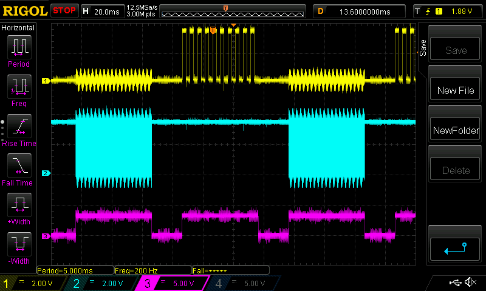

# rp2040-pio-restart

This is an investigation into loading, starting, stopping, restarting
and unloading PIO programs on the RP2040.

It was having a problem with a project I was working on. It used several
PIO programs, each of which it loaded, ran, then unloaded, in turn,
repeating indefinitely to test a piece of hardware. It was failing in
intermittent and weird ways, so I wrote this code to use as a basis for
working out what was happening.

This code has 2 PIO programs, both nicked from the Pico examples. One
pulses a pin at a given frequency, the other pulses a pin in a squarewave.
What these programs do isn't really important; what's important is that
one is loaded, runs correctly, then is stopped and unloaded so the other
program can be loaded and run - repeatedly.

When running correctly the output looks like this:

Yellow is the low frequency PIO program, running for 50ms. That stops and
the other test is put in place. The cyan trace is the high frequency square
wave (it looks solid in that capture, but trust me, it's a wave). Purple is
just showing (high) when either test is running.

But honestly, you can ignore the above. What the tests do doesn't really
matter. What's important is that one test starts, runs, then stops, then
the other test starts, runs and stops, repeatedly. It wasn't clear from the
RP2040 docs how to make that happen. My code is well commented and easy to
fiddle about with.

The answer to the original mystery is that when a PIO program is stopped and
replaced by a different program, the state machine needs to be re-initialised.
This is because the state machine has a hardware program counter which isn't reset when
the new program is loaded. So if you don't reset the program counter manually,
when you start the state machine with the new program in place, it won't start
at the first instruction, it will start at some arbitrary place. The fix is a
call to pio_sm_init() (which sorts the PC out for you), or, as demonstrated
here, manually doing the same steps as that call does. It actually injects a
PIO "JMP 0" instruction into the state machine (where '0' is probably an actual
zero, or the actual PIO instruction offset you want to start your program at.)

Well, all this was useful to me, so it might be useful to someone else. :)

[Derek Fountain](https://www.derekfountain.org/), January 2024